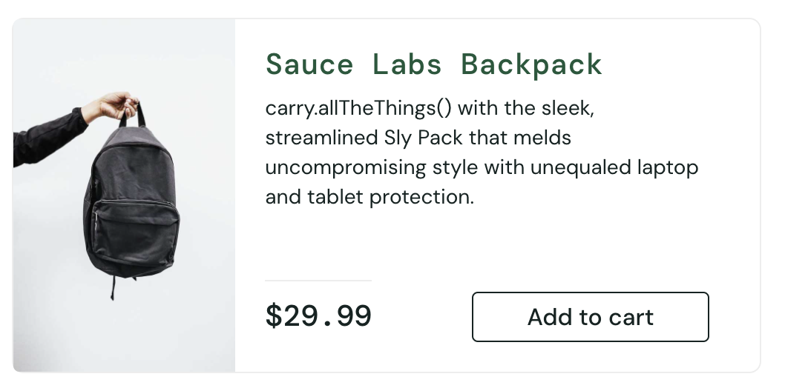
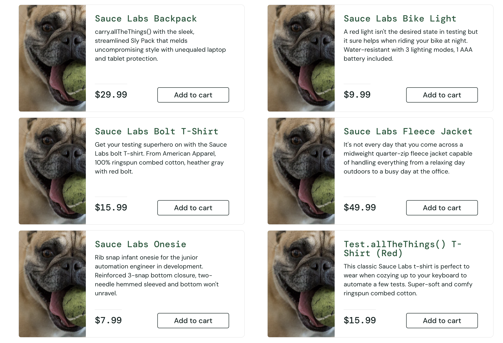
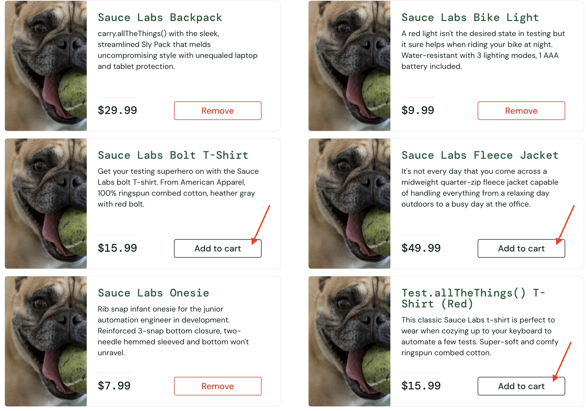
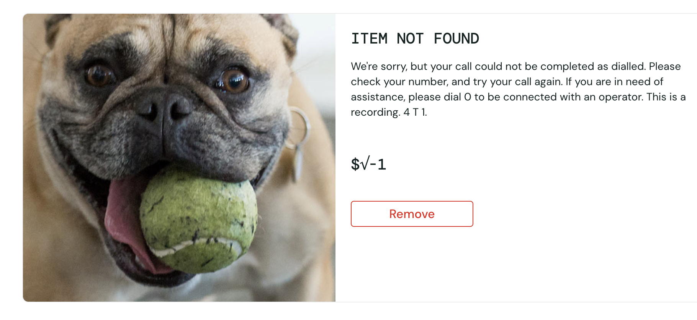
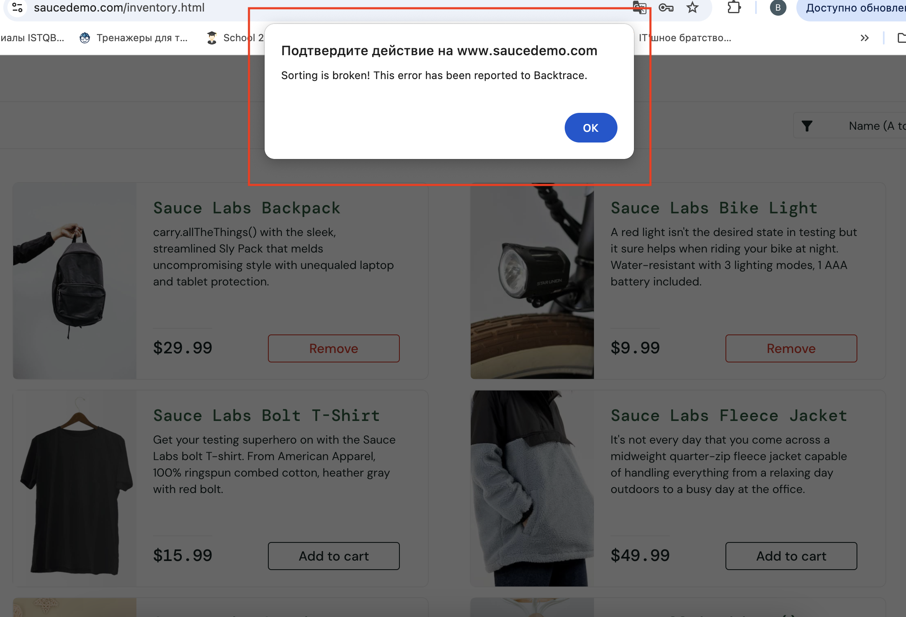

# Баг-репорт
1. ID1

2. Заголовок: Опечатка в описании карточки товара Sauce Labs Backpack при просмотре с главной страницы и на странице товара

3. Проект - интернет-магазин saucedemo.com

4. Шаги воспроизведения   
1) Авторизоваться на сайте https://www.saucedemo.com/ (логин: standard_user, пароль: secret_sauce)
2) Прочитать описание товара Sauce Labs Backpack с главной страницы 
3) Открыть карточку товара Sauce Labs Backpack и прочитать описание  

5. Воспроизводимость: всегда

6. Фактический результат: "carry.allTheThings() with the sleek, streamlined Sly Pack that melds uncompromising style with unequaled laptop and tablet protection."

7. Ожидаемый результат: "Сarry all the things with the sleek, streamlined Sly Pack that melds uncompromising style with unequaled laptop and tablet protection."

8. Окружение:  
Браузер: Google Chrome Версия: 136.0.7103.93 (x86_64)  
ОС: MacOS  
Версия сайта: Saucedemo (актуальная на 19.05.2025)   

9. Серьезность (Severity): Minor
(не влияет на работу сайта)

10. Приоритет (Priority): Low
(В обозримом будущем исправление данного дефекта не окажет существенного влияния на повышение качества продукта)

11. Скрин ошибки
 

Тестировщик: stomachs (Валерия Зубкова)  
Дата: 19.05.2025

# Баг-репорт
1. ID2

2. Заголовок: Неправильное отображение изображений при просмотре главной страницы

3. Проект - интернет-магазин saucedemo.com

4. Шаги воспроизведения   
1) Авторизоваться на сайте https://www.saucedemo.com/ (логин: problem_user, пароль: secret_sauce)
2) Посмотреть отображение изображений с главной страницы 

5. Воспроизводимость: всегда

6. Фактический результат: Изображения, не соответсвующие карточкам товаров

7. Ожидаемый результат: Изображения отображаются в соответсвии с товаром

8. Окружение:  
Браузер: Google Chrome Версия: 136.0.7103.93 (x86_64)  
ОС: MacOS  
Версия сайта: Saucedemo (актуальная на 19.05.2025)   

9. Серьезность (Severity): Major 

10. Приоритет (Priority): High

11. Скрин ошибки
 

Тестировщик: stomachs  
Дата: 19.05.2025

# Баг-репорт
1. ID3

2. Заголовок: Не работает кнопка Add to cart с главной страницы

3. Проект - интернет-магазин saucedemo.com

4. Шаги воспроизведения   
1) Авторизоваться на сайте https://www.saucedemo.com/ (логин: problem_user, пароль: secret_sauce)
2) Нажать кнопку Add to cart возле каждого товара

5. Воспроизводимость: всегда

6. Фактический результат: Sauce Labs Bolt T-Shirt, Sauce Labs Fleece Jacket, Test.allTheThings() T-Shirt (Red) не работает кнопка Add to cart

7. Ожидаемый результат: кнопка Add to cart работает на каждой карточке товара

8. Окружение:  
Браузер: Google Chrome Версия: 136.0.7103.93 (x86_64)  
ОС: MacOS  
Версия сайта: Saucedemo (актуальная на 19.05.2025)   

9. Серьезность (Severity): Critical

10. Приоритет (Priority): High

11. Скрин ошибки
 

Тестировщик: stomachs  
Дата: 19.05.2025

# Баг-репорт
1. ID4

2. Заголовок: Неверное отображение описания, изображения, заголовка и цены при переходе в карточку товара Sauce Labs Fleece Jacket

3. Проект - интернет-магазин saucedemo.com

4. Шаги воспроизведения   
1) Авторизоваться на сайте https://www.saucedemo.com/ (логин: problem_user, пароль: secret_sauce)
2) Перейти в карточку товара Sauce Labs Fleece Jacket

5. Воспроизводимость: всегда

6. Фактический результат: Неверное отображение описания, изображения, заголовка и цены при переходе в карточку товара Sauce Labs Fleece Jacket

7. Ожидаемый результат: Верное отображение изображения, заголовка (Sauce Labs Fleece Jacket), описания (It's not every day that you come across a midweight quarter-zip fleece jacket capable of handling everything from a relaxing day outdoors to a busy day at the office.), цены товара ($49.99) Sauce Labs Fleece Jacket

8. Окружение:  
Браузер: Google Chrome Версия: 136.0.7103.93 (x86_64)  
ОС: MacOS  
Версия сайта: Saucedemo (актуальная на 19.05.2025)   

9. Серьезность (Severity): Critical

10. Приоритет (Priority): High

11. Скрин ошибки
 

Тестировщик: stomachs  
Дата: 19.05.2025

# Баг-репорт
1. ID5

2. Заголовок: Высвечивается окно с ошибкой при попытке сортировке товаров

3. Проект - интернет-магазин saucedemo.com

4. Шаги воспроизведения   
1) Авторизоваться на сайте https://www.saucedemo.com/ (логин: error_user, пароль: secret_sauce)
2) Нажать на кнопку фильтра на главной странице и выбрать сортировку

5. Воспроизводимость: всегда

6. Фактический результат: отображение окна с ошибкой (Sorting is broken! This error has been reported to Backtrace.)

7. Ожидаемый результат: верное отображение отсортированных товаров на главной странице

8. Окружение:  
Браузер: Google Chrome Версия: 136.0.7103.93 (x86_64)  
ОС: MacOS  
Версия сайта: Saucedemo (актуальная на 19.05.2025)   

9. Серьезность (Severity): Major

10. Приоритет (Priority): Low

11. Скрин ошибки
 

Тестировщик: stomachs  
Дата: 19.05.2025