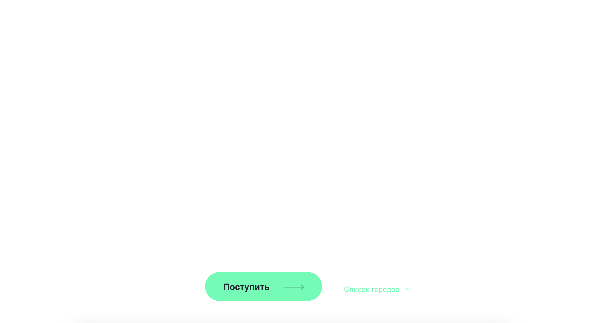
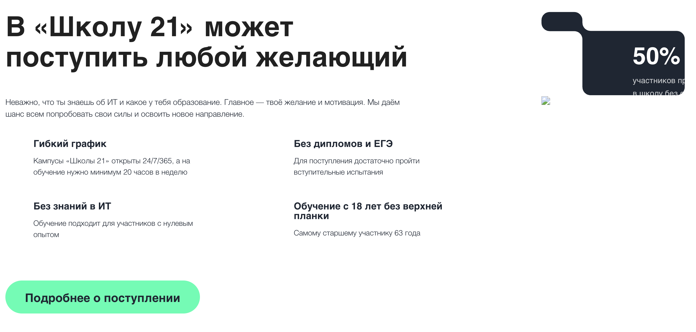
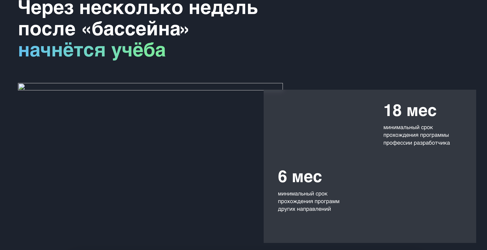
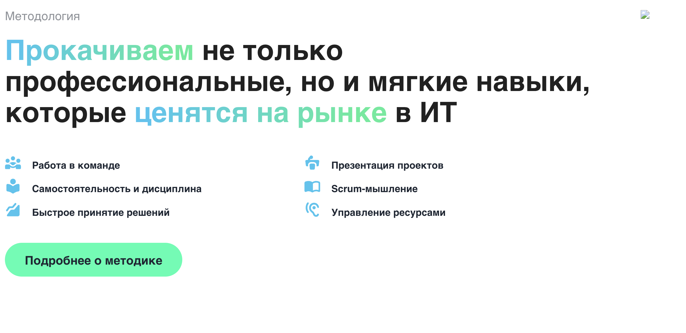
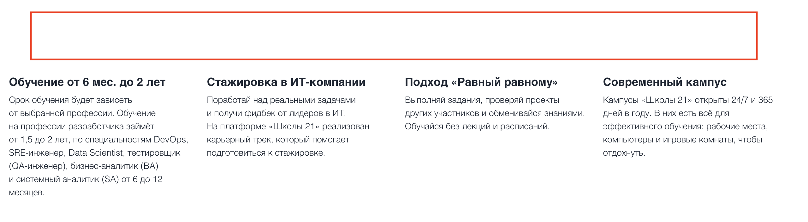
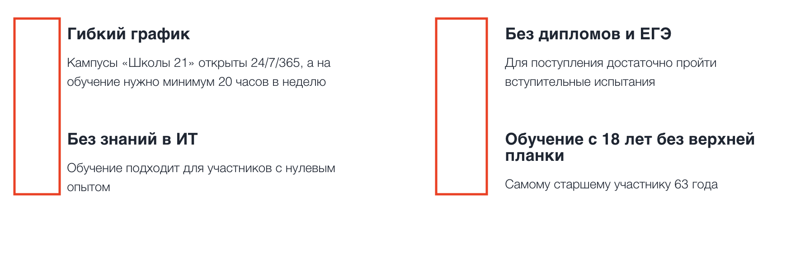
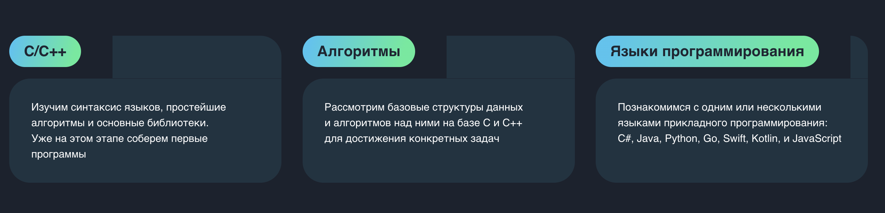
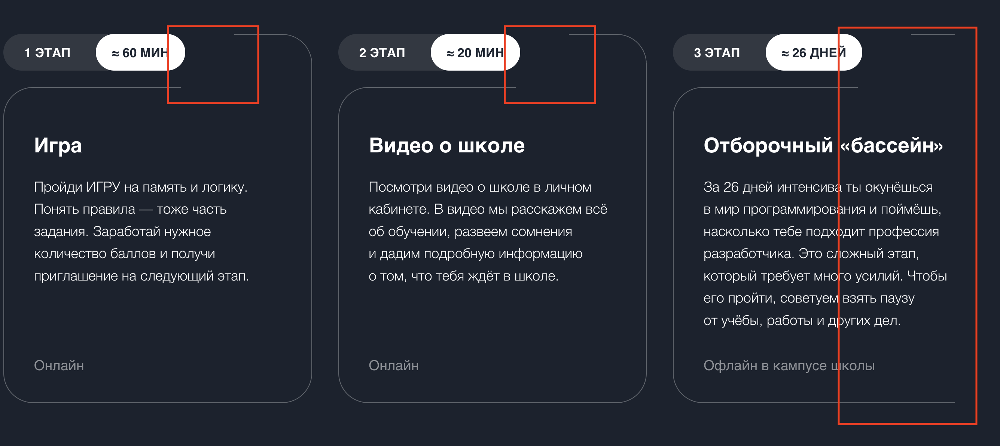
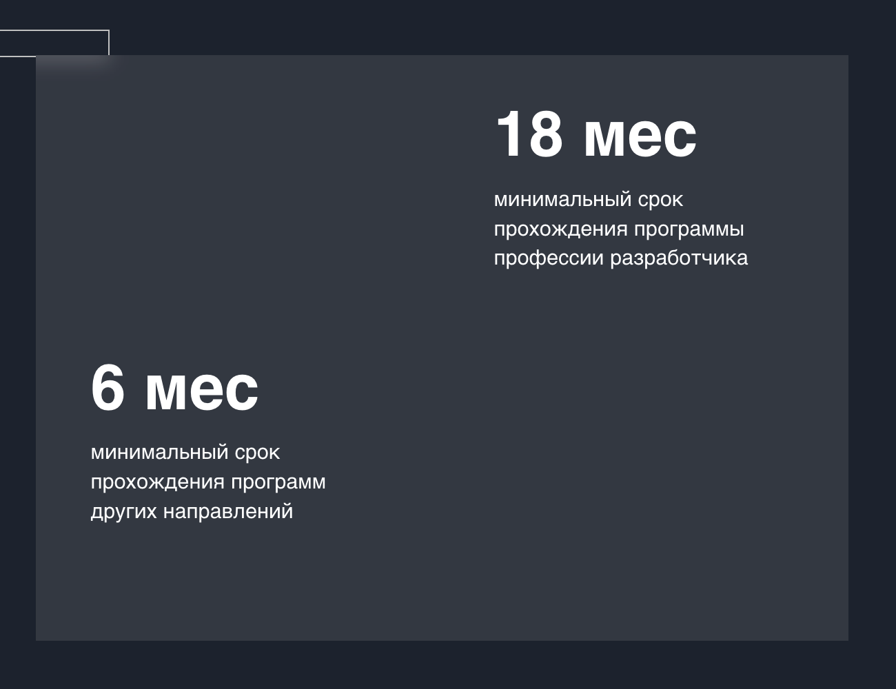
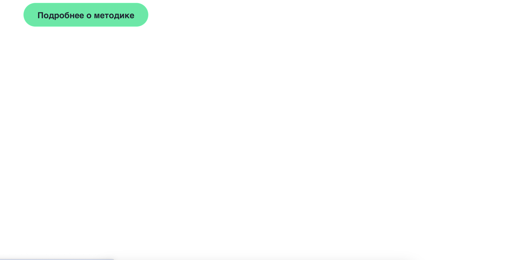

# Тестирование UI веб-сайта
|Баг-репорт| |
|-----|----|
|1. Идентификатор| ID1|
|2. Заголовок| На странице не отображаются изображения|
|3. Проект| Сайт 21school.html|
|4. Шаги воспроизведения|   1) Зайти на сайт 21school.html   2) Просмотреть отбражение изображений на странице|  
|5. Воспроизводимость| всегда|
|6. Фактический результат| На странице не отображаются изображения|
|7. Ожидаемый результат| Соответствие отображения сайта эталону|
|8. Окружение|  Браузер: Версия: 138.0.7204.158 (Официальная сборка) (arm64)   ОС: MacOS   Версия сайта: 21school.html (актуальная на 25.07.2025)|   
|9. Серьезность (Severity)| Major|
|10. Приоритет (Priority)| Normal|
|11. Скрин ошибки| | 
|Тестировщик| stomachs|  
|Дата| 25.07.2025|

|Баг-репорт| |
|-----|----|
|1. Идентификатор| ID2|
|2. Заголовок| На странице не отображаются значки возле описаний|
|3. Проект| Сайт 21school.html|
|4. Шаги воспроизведения|   1) Зайти на сайт 21school.html   2) Просмотреть отбражение значков возле описаний на странице|  
|5. Воспроизводимость| всегда|
|6. Фактический результат| На странице не отображаются значки возле описаний|
|7. Ожидаемый результат| Соответствие отображения сайта эталону|
|8. Окружение|  Браузер: Версия: 138.0.7204.158 (Официальная сборка) (arm64)   ОС: MacOS   Версия сайта: 21school.html (актуальная на 25.07.2025)|   
|9. Серьезность (Severity)| Medium|
|10. Приоритет (Priority)| Normal|
|11. Скрин ошибки| | 
|Тестировщик| stomachs|  
|Дата| 25.07.2025|

|Баг-репорт| |
|-----|----|
|1. Идентификатор| ID3|
|2. Заголовок| На странице неправильно отображаются блоки|
|3. Проект| Сайт 21school.html|
|4. Шаги воспроизведения|   1) Зайти на сайт 21school.html   2) Просмотреть отбражение блоков|  
|5. Воспроизводимость| всегда|
|6. Фактический результат| На странице неправильно отображаются блоки (нет закруглений)|
|7. Ожидаемый результат| Соответствие отображения сайта эталону|
|8. Окружение|  Браузер: Версия: 138.0.7204.158 (Официальная сборка) (arm64)   ОС: MacOS   Версия сайта: 21school.html (актуальная на 25.07.2025)|   
|9. Серьезность (Severity)| Minor|
|10. Приоритет (Priority)| Low|
|11. Скрин ошибки| | 
|Тестировщик| stomachs|  
|Дата| 25.07.2025|

|Баг-репорт| |
|-----|----|
|1. Идентификатор| ID4|
|2. Заголовок| На странице неправильно отображаются границы блоков|
|3. Проект| Сайт 21school.html|
|4. Шаги воспроизведения|   1) Зайти на сайт 21school.html   2) Просмотреть отбражение блоков|  
|5. Воспроизводимость| всегда|
|6. Фактический результат| На странице неправильно отображаются блоки (не полностью замыкаются границы)|
|7. Ожидаемый результат| Соответствие отображения сайта эталону|
|8. Окружение|  Браузер: Версия: 138.0.7204.158 (Официальная сборка) (arm64)   ОС: MacOS   Версия сайта: 21school.html (актуальная на 25.07.2025)|   
|9. Серьезность (Severity)| Minor|
|10. Приоритет (Priority)| Low|
|11. Скрин ошибки| | 
|Тестировщик| stomachs|  
|Дата| 25.07.2025|

|Баг-репорт| |
|-----|----|
|1. Идентификатор| ID5|
|2. Заголовок| На странице не отображаются блоки|
|3. Проект| Сайт 21school.html|
|4. Шаги воспроизведения|   1) Зайти на сайт 21school.html   2) Просмотреть отбражение блоков|  
|5. Воспроизводимость| всегда|
|6. Фактический результат| На странице неправильно отображаются блоки (текст должен быть внутри двух блоков)|
|7. Ожидаемый результат| Соответствие отображения сайта эталону|
|8. Окружение|  Браузер: Версия: 138.0.7204.158 (Официальная сборка) (arm64)   ОС: MacOS   Версия сайта: 21school.html (актуальная на 25.07.2025)|   
|9. Серьезность (Severity)| Minor|
|10. Приоритет (Priority)| Low|
|11. Скрин ошибки| | 
|Тестировщик| stomachs|  
|Дата| 25.07.2025|

|Баг-репорт| |
|-----|----|
|1. Идентификатор| ID6|
|2. Заголовок| На странице не отображается раздел Кампусы|
|3. Проект| Сайт 21school.html|
|4. Шаги воспроизведения|   1) Зайти на сайт 21school.html   2) Просмотреть разделы|  
|5. Воспроизводимость| всегда|
|6. Фактический результат| На странице не отображается раздел Кампусы, вместо него пустой раздел|
|7. Ожидаемый результат| Соответствие отображения сайта эталону|
|8. Окружение|  Браузер: Версия: 138.0.7204.158 (Официальная сборка) (arm64)   ОС: MacOS   Версия сайта: 21school.html (актуальная на 25.07.2025)|   
|9. Серьезность (Severity)| Major|
|10. Приоритет (Priority)| High|
|11. Скрин ошибки| | 
|Тестировщик| stomachs|  
|Дата| 25.07.2025|